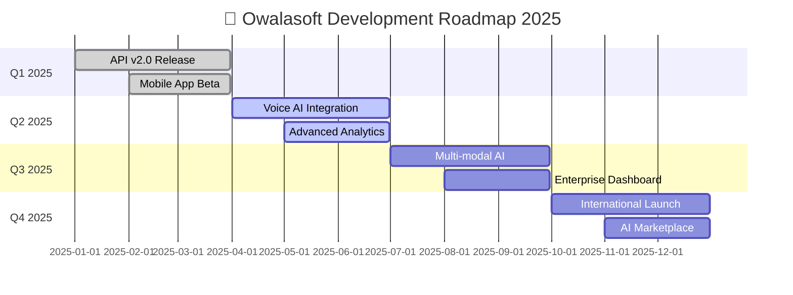

# 

  

  

---

##  **Tentang Owalasoft**

**Owalasoft** adalah platform teknologi AI buatan Indonesia.  
Kami menyediakan berbagai layanan AI gratis dan inovatif, seperti:

| 🎯 **Layanan** | 🔥 **Fitur** | ⚡ **Status** |
|:---:|:---:|:---:|
| 🤖 **Chatbot WhatsApp & Telegram** | AI Natural Language |  |
| 🖼️ **Generator & Analisis Gambar AI** | Image Processing |  |
| 🧠 **OwaAI** | Chatbot AI Cerdas |  |
| 🧰 **Owalasoft Studio** | Alat AI Interaktif |  |
| ⚙️ **API Chatbot** | Gratis & Terbuka |  |

  

---

##  **Website Resmi**

<table>
<tr>
<td align="center" width="50%">

  

  
<i>Website Utama Official</i>
</td>
<td align="center" width="50%">

  

  
<i>Portal Layanan & Tools</i>
</td>
</tr>
</table>

---

##  **Layanan AI dari Owalasoft**

### 🧠 **OwaAI - Chatbot AI Cerdas**

### 🧰 **Owalasoft Studio - Kumpulan Tools AI**

### ⚙️ **API Chatbot Gratis**

### 🤖 **Bot WhatsApp & Telegram**

  

---

##  **Statistik & Performa**

<table>
<tr>
<td align="center">

</td>
<td align="center">

</td>
</tr>
</table>

### 📊 **Real-time Analytics**

| 📈 **Metrik** | 📊 **Jumlah** | 🔥 **Status** |
|:---:|:---:|:---:|
| 👥 **Users Aktif** | **1000+** |  |
| 🛠️ **AI Tools** | **10+** |  |
| ⚡ **Uptime** | **99.9%** |  |
| 🆓 **Gratis** | **100%** |  |

---

##  **Tech Stack & Arsitektur**

### 🛠️ **Backend Technologies**

### 🎨 **Frontend Technologies**

### 🗄️ **Database & Cloud**

### 🔧 **DevOps & Tools**

---

##  **Saluran Info & Komunitas**

<table>
<tr>
<td align="center" width="50%">

  
<h3>🔔 <b>Update Resmi & Pengumuman</b></h3>

  
<i>Update fitur terbaru & pengumuman penting</i>
</td>
<td align="center" width="50%">

  
<h3>💬 <b>Komunitas Pengguna & Diskusi</b></h3>

  
<i>Diskusi dengan sesama pengguna & support</i>
</td>
</tr>
</table>

---

##  **Roadmap 2025**

```mermaid
gantt
    title 🚀 Owalasoft Development Roadmap 2025
    dateFormat  YYYY-MM-DD
    section Q1 2025
    API v2.0 Release    :done, api-v2, 2025-01-01, 2025-03-31
    Mobile App Beta     :done, mobile-beta, 2025-02-01, 2025-03-31
    section Q2 2025
    Voice AI Integration :active, voice-ai, 2025-04-01, 2025-06-30
    Advanced Analytics   :active, analytics, 2025-05-01, 2025-06-30
    section Q3 2025
    Multi-modal AI       :multimodal, 2025-07-01, 2025-09-30
    Enterprise Dashboard :enterprise, 2025-08-01, 2025-09-30
    section Q4 2025
    International Launch :intl, 2025-10-01, 2025-12-31
    AI Marketplace       :marketplace, 2025-11-01, 2025-12-31
```

---

##  **Kolaborasi & Kontak**

### 🤝 **Kami Terbuka untuk Kerja Sama**

| 🎯 **Jenis Kolaborasi** | 💼 **Deskripsi** | 🔗 **Aksi** |
|:---:|:---:|:---:|
| 🤝 **Partnership** | Kerja sama strategis |  |
| 🔗 **Integration** | API Integration |  |
| 🔬 **Research** | AI Research Collab |  |
| 💰 **Investment** | Funding & Support |  |

 

### 📩 **Hubungi Kami Sekarang**

---

##  **Contributor Hall of Fame**

### 🏆 **Top Contributors**

<table>
<tr>
<td align="center">

 
<b>Core Team</b>
 
🥇 Founder & Lead Developer
</td>
<td align="center">

 
<b>AI Engineer</b>
 
🥈 Machine Learning Expert
</td>
<td align="center">

 
<b>Community</b>
 
🥉 Community Manager
</td>
</tr>
</table>

---

##  **Support Our Mission**

### 🎯 **Cara Mendukung Owalasoft**

---

# 🙏 **Terima kasih telah mendukung teknologi AI** 🇮🇩
## **Follow dan sebarkan Owalasoft untuk mendukung karya anak bangsa!**

### 🔗 **Quick Access Panel**

<table>
<tr>
<td align="center">

</td>
<td align="center">

</td>
<td align="center">

</td>
</tr>
<tr>
<td align="center">

</td>
<td align="center">

</td>
<td align="center">

</td>
</tr>
</table>

---

